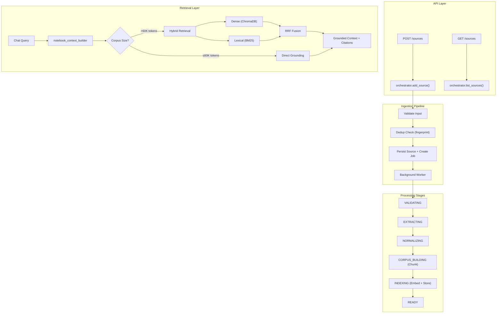

# NotebookLM Corpus Pipeline — Walkthrough

## Overview

Transformed the KeplerLab-Agentic backend from a decommissioned RAG stub into a production-grade, source-grounded notebook corpus system. The implementation spans **35+ modules** across **9 phases**, delivering a complete ingestion → extraction → chunking → indexing → retrieval pipeline.

## Architecture Diagram



---

## DB Schema Changes

```diff:schema.prisma
// Prisma Schema for KeplerLab AI Notebook
// Run: prisma db push   (to sync schema to DB)
// Run: prisma generate  (to generate Python client)

generator client {
  provider             = "prisma-client-py"
  interface            = "asyncio"
  recursive_type_depth = 5
}

datasource db {
  provider = "postgresql"
  url      = env("DATABASE_URL")
}

// ─── Enums ───────────────────────────────────────────────

enum UserRole {
  USER
  ADMIN
}

enum VideoStatus {
  pending
  processing
  capturing_slides
  generating_script
  generating_audio
  composing_video
  completed
  failed
}

enum ExportStatus {
  pending
  processing
  completed
  failed
}

enum GeneratedContentType {
  PRESENTATION
}

enum SkillRunStatus {
  pending
  running
  completed
  failed
}

// ─── Users ───────────────────────────────────────────────

model User {
  id             String    @id @default(uuid()) @db.Uuid
  email          String    @unique @db.VarChar(255)
  username       String    @db.VarChar(100)
  hashedPassword String    @map("hashed_password") @db.VarChar(255)
  isActive       Boolean   @default(true) @map("is_active")
  role           UserRole  @default(USER)
  deletedAt      DateTime? @map("deleted_at")
  createdAt      DateTime  @default(now()) @map("created_at")
  updatedAt      DateTime  @default(now()) @updatedAt @map("updated_at")

  notebooks        Notebook[]
  materials        Material[]
  chatSessions     ChatSession[]
  chatMessages     ChatMessage[]
  generatedContent GeneratedContent[]
  refreshTokens    RefreshToken[]
  backgroundJobs   BackgroundJob[]
  tokenUsage       UserTokenUsage[]
  apiUsageLogs     ApiUsageLog[]
  agentLogs        AgentExecutionLog[]
  codeExecutions   CodeExecutionSession[]
  researchSessions ResearchSession[]
  explainerVideos  ExplainerVideo[]
  podcastSessions  PodcastSession[]
  artifacts        Artifact[]
  sourceSelections NotebookSourceSelection[]
  skills           Skill[]
  skillRuns        SkillRun[]
  sources          Source[]

  @@map("users")
}

// ─── Notebooks ───────────────────────────────────────────

model Notebook {
  id          String   @id @default(uuid()) @db.Uuid
  userId      String   @map("user_id") @db.Uuid
  name        String   @db.VarChar(255)
  description String?  @db.Text
  createdAt   DateTime @default(now()) @map("created_at")
  updatedAt   DateTime @default(now()) @updatedAt @map("updated_at")

  owner            User               @relation(fields: [userId], references: [id], onDelete: Cascade)
  materials        Material[]
  chatSessions     ChatSession[]
  chatMessages     ChatMessage[]
  generatedContent GeneratedContent[]
  agentLogs        AgentExecutionLog[]
  codeExecutions   CodeExecutionSession[]
  researchSessions ResearchSession[]
  podcastSessions  PodcastSession[]
  artifacts        Artifact[]
  sourceSelections NotebookSourceSelection[]
  skills           Skill[]
  skillRuns        SkillRun[]

  @@index([userId])
  @@map("notebooks")
}

// ─── Materials ───────────────────────────────────────────

enum MaterialStatus {
  pending
  validating
  processing
  ocr_running
  transcribing
  chunking
  embedding
  completed
  failed
}

model Material {
  id           String         @id @default(uuid()) @db.Uuid
  userId       String         @map("user_id") @db.Uuid
  notebookId   String?        @map("notebook_id") @db.Uuid
  filename     String         @db.VarChar(255)
  title        String?        @db.VarChar(510) // For custom titles (URLs, etc.)
  originalText String?        @map("original_text") @db.Text
  status       MaterialStatus @default(pending)
  chunkCount   Int            @default(0) @map("chunk_count")
  sourceType   String?        @default("file") @map("source_type") @db.VarChar(50) // 'file', 'url', 'youtube', 'text'
  metadata     Json? // Extraction metadata (migrated from String)
  error        String?        @db.Text // Error message if processing failed
  sourceId     String?        @unique @map("source_id") @db.Uuid
  createdAt    DateTime       @default(now()) @map("created_at")
  updatedAt    DateTime       @default(now()) @updatedAt @map("updated_at")

  owner                    User                       @relation(fields: [userId], references: [id], onDelete: Cascade)
  notebook                 Notebook?                  @relation(fields: [notebookId], references: [id], onDelete: SetNull)
  source                   Source?                    @relation(fields: [sourceId], references: [id], onDelete: SetNull)
  generatedContent         GeneratedContent[]
  generatedContentJoins    GeneratedContentMaterial[]
  podcastSessionJoins      PodcastSessionMaterial[]

  @@index([userId])
  @@index([notebookId])
  @@index([sourceType])
  @@map("materials")
}

// ─── Chat Sessions ───────────────────────────────────────

model ChatSession {
  id         String   @id @default(uuid()) @db.Uuid
  notebookId String   @map("notebook_id") @db.Uuid
  userId     String   @map("user_id") @db.Uuid
  title      String   @default("New Chat") @db.VarChar(255)
  createdAt  DateTime @default(now()) @map("created_at")
  updatedAt  DateTime @default(now()) @updatedAt @map("updated_at")

  notebook     Notebook      @relation(fields: [notebookId], references: [id], onDelete: Cascade)
  user         User          @relation(fields: [userId], references: [id], onDelete: Cascade)
  chatMessages ChatMessage[]
  artifacts    Artifact[]

  @@index([notebookId])
  @@index([userId])
  @@map("chat_sessions")
}

model NotebookSourceSelection {
  id         String   @id @default(uuid()) @db.Uuid
  notebookId String   @map("notebook_id") @db.Uuid
  userId     String   @map("user_id") @db.Uuid
  materialIds String[] @default([]) @map("material_ids")
  createdAt  DateTime @default(now()) @map("created_at")
  updatedAt  DateTime @default(now()) @updatedAt @map("updated_at")

  notebook Notebook @relation(fields: [notebookId], references: [id], onDelete: Cascade)
  user     User     @relation(fields: [userId], references: [id], onDelete: Cascade)

  @@unique([notebookId, userId])
  @@index([notebookId])
  @@index([userId])
  @@map("notebook_source_selections")
}

// ─── Chat Messages ───────────────────────────────────────

model ChatMessage {
  id            String   @id @default(uuid()) @db.Uuid
  notebookId    String   @map("notebook_id") @db.Uuid
  userId        String   @map("user_id") @db.Uuid
  chatSessionId String?  @map("chat_session_id") @db.Uuid
  role          String   @db.VarChar(20)
  content       String   @db.Text
  agentMeta     String?  @map("agent_meta") @db.Text  // JSON: intent, tools_used, step_log, etc.
  createdAt     DateTime @default(now()) @map("created_at")

  notebook    Notebook     @relation(fields: [notebookId], references: [id], onDelete: Cascade)
  user        User         @relation(fields: [userId], references: [id], onDelete: Cascade)
  chatSession ChatSession? @relation(fields: [chatSessionId], references: [id], onDelete: Cascade)

  responseBlocks ResponseBlock[]
  artifacts      Artifact[]

  @@index([chatSessionId])
  @@index([notebookId])
  @@index([notebookId, createdAt])
  @@map("chat_messages")
}

// ─── Generated Content ───────────────────────────────────

model GeneratedContent {
  id String @id @default(uuid()) @db.Uuid
  notebookId String @map("notebook_id") @db.Uuid
  userId String @map("user_id") @db.Uuid
  materialId String? @map("material_id") @db.Uuid
  contentType String @map("content_type") @db.VarChar(50)
  title String? @db.VarChar(255)
  data Json?
  htmlPath String? @map("html_path") @db.Text
  pptPath String? @map("ppt_path") @db.Text
  language String? @db.VarChar(10)
  materialIds String[] @default([]) @map("material_ids") // Legacy — use GeneratedContentMaterial join table
  rating String? @db.VarChar(10) // 'positive' or 'negative'
  createdAt DateTime @default(now()) @map("created_at")

  notebook Notebook @relation(fields: [notebookId], references: [id], onDelete: Cascade)
  user User @relation(fields: [userId], references: [id], onDelete: Cascade)
  material Material? @relation(fields: [materialId], references: [id], onDelete: Cascade)
  explainerVideos ExplainerVideo[]
  materialJoins GeneratedContentMaterial[]

  @@index([notebookId, userId, contentType])
  @@map("generated_content")
}

model GeneratedContentMaterial {
  generatedContentId String @map("generated_content_id") @db.Uuid
  materialId         String @map("material_id") @db.Uuid

  generatedContent GeneratedContent @relation(fields: [generatedContentId], references: [id], onDelete: Cascade)
  material         Material         @relation(fields: [materialId], references: [id], onDelete: Cascade)

  @@id([generatedContentId, materialId])
  @@map("generated_content_materials")
}

// ─── Explainer Videos ────────────────────────────────────

model ExplainerVideo {
  id                String    @id @default(uuid()) @db.Uuid
  userId            String    @map("user_id") @db.Uuid
  presentationId    String    @map("presentation_id") @db.Uuid
  pptLanguage       String    @map("ppt_language") @db.VarChar(10)
  narrationLanguage String    @map("narration_language") @db.VarChar(10)
  voiceGender       String    @map("voice_gender") @db.VarChar(10)
  voiceId           String    @map("voice_id") @db.VarChar(100)
  status            VideoStatus @default(pending)
  script            Json?
  audioFiles        Json?     @map("audio_files")
  videoUrl          String?   @map("video_url") @db.Text
  duration          Int?
  chapters          Json?
  error             String?   @db.Text
  createdAt         DateTime  @default(now()) @map("created_at")
  completedAt       DateTime? @map("completed_at")

  user         User             @relation(fields: [userId], references: [id], onDelete: Cascade)
  presentation GeneratedContent @relation(fields: [presentationId], references: [id], onDelete: Cascade)

  @@index([userId, status])
  @@map("explainer_videos")
}

// ─── Refresh Tokens (rotation tracking) ──────────────────

model RefreshToken {
  id        String   @id @default(uuid()) @db.Uuid
  userId    String   @map("user_id") @db.Uuid
  tokenHash String   @unique @map("token_hash") @db.VarChar(255)
  family    String   @db.VarChar(255) // Token family for rotation detection
  used      Boolean  @default(false)
  expiresAt DateTime @map("expires_at")
  createdAt DateTime @default(now()) @map("created_at")

  user User @relation(fields: [userId], references: [id], onDelete: Cascade)

  @@index([userId])
  @@index([family])
  @@map("refresh_tokens")
}

// ─── Background Jobs ─────────────────────────────────────

// TO_REMOVE: This enum is only used by the legacy background worker.
enum JobStatus {
  pending
  validating
  processing
  ocr_running
  transcribing
  chunking
  embedding
  completed
  failed
  dead_letter
}

// TO_REMOVE: This model is only used by the legacy background worker.
model BackgroundJob {
  id        String    @id @default(uuid()) @db.Uuid
  userId    String    @map("user_id") @db.Uuid
  jobType   String    @map("job_type") @db.VarChar(50)
  status    JobStatus @default(pending)
  result    Json?
  error     String?   @db.Text
  createdAt DateTime  @default(now()) @map("created_at")
  updatedAt DateTime  @default(now()) @updatedAt @map("updated_at")

  user User @relation(fields: [userId], references: [id], onDelete: Cascade)

  @@index([userId])
  @@map("background_jobs")
}

// ─── User Token Usage ────────────────────────────────────

model UserTokenUsage {
  id          String   @id @default(uuid()) @db.Uuid
  userId      String   @map("user_id") @db.Uuid
  date        DateTime @db.Date
  tokensUsed  Int      @default(0) @map("tokens_used")
  createdAt   DateTime @default(now()) @map("created_at")
  updatedAt   DateTime @default(now()) @updatedAt @map("updated_at")

  user User @relation(fields: [userId], references: [id], onDelete: Cascade)

  @@unique([userId, date])
  @@index([userId])
  @@index([date])
  @@map("user_token_usage")
}

// ─── API Usage Logs ──────────────────────────────────────

model ApiUsageLog {
  id                 String   @id @default(uuid()) @db.Uuid
  userId             String   @map("user_id") @db.Uuid
  endpoint           String   @db.VarChar(255)
  materialIds        String[] @map("material_ids")
  contextTokenCount  Int      @default(0) @map("context_token_count")
  responseTokenCount Int      @default(0) @map("response_token_count")
  modelUsed          String   @map("model_used") @db.VarChar(100)
  llmLatency         Float    @default(0) @map("llm_latency")
  retrievalLatency   Float    @default(0) @map("retrieval_latency")
  totalLatency       Float    @default(0) @map("total_latency")
  createdAt          DateTime @default(now()) @map("created_at")

  user User @relation(fields: [userId], references: [id], onDelete: Cascade)

  @@index([userId])
  @@index([endpoint])
  @@index([createdAt])
  @@map("api_usage_logs")
}

// ─── Agent Execution Log ─────────────────────────────────

model AgentExecutionLog {
  id            String   @id @default(uuid()) @db.Uuid
  userId        String   @map("user_id") @db.Uuid
  notebookId    String   @map("notebook_id") @db.Uuid
  intent        String   @db.VarChar(50)
  confidence    Float    @default(0.0)
  toolsUsed     String[] @map("tools_used")
  stepsCount    Int      @default(0) @map("steps_count")
  tokensUsed    Int      @default(0) @map("tokens_used")
  elapsedTime   Float    @default(0.0) @map("elapsed_time")
  createdAt     DateTime @default(now()) @map("created_at")

  user     User     @relation(fields: [userId], references: [id], onDelete: Cascade)
  notebook Notebook @relation(fields: [notebookId], references: [id], onDelete: Cascade)

  @@index([userId])
  @@index([notebookId])
  @@map("agent_execution_logs")
}

// ─── Response Blocks (for paragraph-level chat) ──────────

model ResponseBlock {
  id            String   @id @default(uuid()) @db.Uuid
  chatMessageId String   @map("chat_message_id") @db.Uuid
  blockIndex    Int      @map("block_index")
  text          String   @db.Text
  createdAt     DateTime @default(now()) @map("created_at")

  chatMessage   ChatMessage @relation(fields: [chatMessageId], references: [id], onDelete: Cascade)

  @@index([chatMessageId])
  @@map("response_blocks")
}

// ─── Code Execution Sessions ─────────────────────────────

model CodeExecutionSession {
  id            String   @id @default(uuid()) @db.Uuid
  userId        String   @map("user_id") @db.Uuid
  notebookId    String   @map("notebook_id") @db.Uuid
  code          String   @db.Text
  stdout        String?  @db.Text
  stderr        String?  @db.Text
  exitCode      Int      @default(-1) @map("exit_code")
  hasChart      Boolean  @default(false) @map("has_chart")
  elapsedTime   Float    @default(0.0) @map("elapsed_time")
  createdAt     DateTime @default(now()) @map("created_at")

  user     User     @relation(fields: [userId], references: [id], onDelete: Cascade)
  notebook Notebook @relation(fields: [notebookId], references: [id], onDelete: Cascade)

  @@index([userId])
  @@index([notebookId])
  @@map("code_execution_sessions")
}

// ─── Research Sessions ───────────────────────────────────

model ResearchSession {
  id            String   @id @default(uuid()) @db.Uuid
  userId        String   @map("user_id") @db.Uuid
  notebookId    String   @map("notebook_id") @db.Uuid
  query         String   @db.Text
  report        String?  @db.Text
  sourcesCount  Int      @default(0) @map("sources_count")
  queriesCount  Int      @default(0) @map("queries_count")
  iterations    Int      @default(1)
  elapsedTime   Float    @default(0.0) @map("elapsed_time")
  sourceUrls    String[] @default([]) @map("source_urls")
  createdAt     DateTime @default(now()) @map("created_at")

  user     User     @relation(fields: [userId], references: [id], onDelete: Cascade)
  notebook Notebook @relation(fields: [notebookId], references: [id], onDelete: Cascade)

  @@index([userId])
  @@index([notebookId])
  @@map("research_sessions")
}

// ─── Podcast Sessions (Live Podcast Feature) ─────────────

enum PodcastSessionStatus {
  created
  script_generating
  audio_generating
  ready
  playing
  paused
  completed
  failed
}

model PodcastSession {
  id               String               @id @default(uuid()) @db.Uuid
  notebookId       String               @map("notebook_id") @db.Uuid
  userId           String               @map("user_id") @db.Uuid
  mode             String               @default("full") @db.VarChar(20) // 'full' or 'topic'
  topic            String?              @db.Text
  language         String               @default("en") @db.VarChar(10)
  status           PodcastSessionStatus @default(created)
  currentSegment   Int                  @default(0) @map("current_segment")
  hostVoice        String               @default("en-US-GuyNeural") @map("host_voice") @db.VarChar(100)
  guestVoice       String               @default("en-US-JennyNeural") @map("guest_voice") @db.VarChar(100)
  title            String?              @db.VarChar(255)
  tags             String[]             @default([])
  chapters         Json?                // [{name, startSegment}]
  totalDurationMs  Int                  @default(0) @map("total_duration_ms")
  materialIds      String[]             @default([]) @map("material_ids") // Legacy — use PodcastSessionMaterial join table
  summary          String?              @db.Text
  error            String?              @db.Text
  createdAt        DateTime             @default(now()) @map("created_at")
  updatedAt        DateTime             @default(now()) @updatedAt @map("updated_at")
  completedAt      DateTime?            @map("completed_at")

  user            User                     @relation(fields: [userId], references: [id], onDelete: Cascade)
  notebook        Notebook                 @relation(fields: [notebookId], references: [id], onDelete: Cascade)
  segments        PodcastSegment[]
  doubts          PodcastDoubt[]
  exports         PodcastExport[]
  bookmarks       PodcastBookmark[]
  annotations     PodcastAnnotation[]
  materialJoins   PodcastSessionMaterial[]

  @@index([userId])
  @@index([notebookId])
  @@index([userId, status])
  @@map("podcast_sessions")
}

model PodcastSessionMaterial {
  podcastSessionId String @map("podcast_session_id") @db.Uuid
  materialId       String @map("material_id") @db.Uuid

  podcastSession PodcastSession @relation(fields: [podcastSessionId], references: [id], onDelete: Cascade)
  material       Material       @relation(fields: [materialId], references: [id], onDelete: Cascade)

  @@id([podcastSessionId, materialId])
  @@map("podcast_session_materials")
}

model PodcastSegment {
  id          String   @id @default(uuid()) @db.Uuid
  sessionId   String   @map("session_id") @db.Uuid
  index       Int      // sequential order
  speaker     String   @db.VarChar(10) // 'host' or 'guest'
  text        String   @db.Text
  audioUrl    String?  @map("audio_url") @db.Text
  durationMs  Int      @default(0) @map("duration_ms")
  chapter     String?  @db.VarChar(255)
  createdAt   DateTime @default(now()) @map("created_at")

  session PodcastSession @relation(fields: [sessionId], references: [id], onDelete: Cascade)

  @@unique([sessionId, index])
  @@index([sessionId])
  @@map("podcast_segments")
}

model PodcastDoubt {
  id               String    @id @default(uuid()) @db.Uuid
  sessionId        String    @map("session_id") @db.Uuid
  pausedAtSegment  Int       @map("paused_at_segment")
  questionText     String    @map("question_text") @db.Text
  questionAudioUrl String?   @map("question_audio_url") @db.Text
  answerText       String?   @map("answer_text") @db.Text
  answerAudioUrl   String?   @map("answer_audio_url") @db.Text
  resolvedAt       DateTime? @map("resolved_at")
  createdAt        DateTime  @default(now()) @map("created_at")

  session PodcastSession @relation(fields: [sessionId], references: [id], onDelete: Cascade)

  @@index([sessionId])
  @@map("podcast_doubts")
}

model PodcastExport {
  id        String   @id @default(uuid()) @db.Uuid
  sessionId String   @map("session_id") @db.Uuid
  format    String   @db.VarChar(10) // 'pdf' or 'json'
  fileUrl   String?  @map("file_url") @db.Text
  status    ExportStatus @default(pending)
  createdAt DateTime     @default(now()) @map("created_at")

  session PodcastSession @relation(fields: [sessionId], references: [id], onDelete: Cascade)

  @@index([sessionId])
  @@map("podcast_exports")
}

model PodcastBookmark {
  id           String   @id @default(uuid()) @db.Uuid
  sessionId    String   @map("session_id") @db.Uuid
  segmentIndex Int      @map("segment_index")
  label        String?  @db.VarChar(255)
  createdAt    DateTime @default(now()) @map("created_at")

  session PodcastSession @relation(fields: [sessionId], references: [id], onDelete: Cascade)

  @@index([sessionId])
  @@map("podcast_bookmarks")
}

model PodcastAnnotation {
  id           String   @id @default(uuid()) @db.Uuid
  sessionId    String   @map("session_id") @db.Uuid
  segmentIndex Int      @map("segment_index")
  note         String   @db.Text
  createdAt    DateTime @default(now()) @map("created_at")

  session PodcastSession @relation(fields: [sessionId], references: [id], onDelete: Cascade)

  @@index([sessionId])
  @@map("podcast_annotations")
}

// ─── Artifacts (workspace-produced files) ────────────────

model Artifact {
  id            String   @id @default(uuid()) @db.Uuid
  userId        String   @map("user_id") @db.Uuid
  notebookId    String?  @map("notebook_id") @db.Uuid
  sessionId     String?  @map("session_id") @db.Uuid
  messageId     String?  @map("message_id") @db.Uuid
  filename      String   @db.VarChar(255)
  mimeType      String   @map("mime_type") @db.VarChar(128)
  displayType   String?  @map("display_type") @db.VarChar(50)
  sizeBytes     Int      @map("size_bytes")
  downloadToken String   @unique @map("download_token") @db.VarChar(64)
  tokenExpiry   DateTime @map("token_expiry")
  workspacePath String   @map("workspace_path") @db.Text
  sourceCode    String?  @map("source_code") @db.Text
  createdAt     DateTime @default(now()) @map("created_at")

  owner    User         @relation(fields: [userId], references: [id], onDelete: Cascade)
  notebook Notebook?    @relation(fields: [notebookId], references: [id], onDelete: SetNull)
  session  ChatSession? @relation(fields: [sessionId], references: [id], onDelete: SetNull)
  message  ChatMessage? @relation(fields: [messageId], references: [id], onDelete: SetNull)

  @@index([userId])
  @@index([notebookId])
  @@index([sessionId])
  @@index([downloadToken])
  @@map("artifacts")
}

// ─── Skills (Markdown-based AI Workflows) ────────────────

model Skill {
  id          String   @id @default(uuid()) @db.Uuid
  userId      String   @map("user_id") @db.Uuid
  notebookId  String?  @map("notebook_id") @db.Uuid
  slug        String   @db.VarChar(100)
  title       String   @db.VarChar(255)
  description String?  @db.Text
  markdown    String   @db.Text
  version     Int      @default(1)
  isGlobal    Boolean  @default(false) @map("is_global")
  tags        String[] @default([])
  createdAt   DateTime @default(now()) @map("created_at")
  updatedAt   DateTime @default(now()) @updatedAt @map("updated_at")

  owner    User      @relation(fields: [userId], references: [id], onDelete: Cascade)
  notebook Notebook? @relation(fields: [notebookId], references: [id], onDelete: SetNull)
  runs     SkillRun[]

  @@unique([userId, notebookId, slug])
  @@index([userId])
  @@index([notebookId])
  @@index([slug])
  @@map("skills")
}

model SkillRun {
  id          String         @id @default(uuid()) @db.Uuid
  skillId     String         @map("skill_id") @db.Uuid
  userId      String         @map("user_id") @db.Uuid
  notebookId  String?        @map("notebook_id") @db.Uuid
  status      SkillRunStatus @default(pending)
  variables   Json?
  stepLogs    Json?          @map("step_logs")
  result      Json?
  artifacts   Json?
  error       String?        @db.Text
  startedAt   DateTime?      @map("started_at")
  completedAt DateTime?      @map("completed_at")
  elapsedTime Float          @default(0.0) @map("elapsed_time")
  createdAt   DateTime       @default(now()) @map("created_at")

  skill    Skill     @relation(fields: [skillId], references: [id], onDelete: Cascade)
  owner    User      @relation(fields: [userId], references: [id], onDelete: Cascade)
  notebook Notebook? @relation(fields: [notebookId], references: [id], onDelete: SetNull)

  @@index([skillId])
  @@index([userId])
  @@map("skill_runs")
}

// ─── Source Ingestion ────────────────────────────────────

model Source {
  id                String    @id @default(uuid()) @db.Uuid
  userId            String    @map("user_id") @db.Uuid
  notebookId        String?   @map("notebook_id") @db.Uuid
  sourceType        String    @map("source_type") @db.VarChar(50)
  status            String    @default("queued") // Initial status before job creation
  title             String?   @db.VarChar(510)
  originalName      String?   @map("original_name") @db.VarChar(255)
  mimeType          String?   @map("mime_type") @db.VarChar(128)
  sizeBytes         Int?      @map("size_bytes")
  checksum          String?   @db.VarChar(128)
  inputText         String?   @map("input_text") @db.Text
  inputUrl          String?   @map("input_url") @db.Text
  localFilePath     String?   @map("local_file_path") @db.Text
  normalizedMetadata Json?     @map("normalized_metadata")
  errorCode         String?   @map("error_code") @db.VarChar(100)
  errorMessage      String?   @map("error_message") @db.Text
  retryCount        Int       @default(0) @map("retry_count")
  createdAt         DateTime  @default(now()) @map("created_at")
  updatedAt         DateTime  @default(now()) @updatedAt @map("updated_at")
  processedAt       DateTime? @map("processed_at")

  user User @relation(fields: [userId], references: [id], onDelete: Cascade)
  material Material?

  @@index([userId])
  @@index([checksum])
  @@map("sources")
}

===
// Prisma Schema for KeplerLab AI Notebook
// Run: prisma db push   (to sync schema to DB)
// Run: prisma generate  (to generate Python client)

generator client {
  provider             = "prisma-client-py"
  interface            = "asyncio"
  recursive_type_depth = 5
}

datasource db {
  provider = "postgresql"
  url      = env("DATABASE_URL")
}

// ─── Enums ───────────────────────────────────────────────

enum UserRole {
  USER
  ADMIN
}

enum VideoStatus {
  pending
  processing
  capturing_slides
  generating_script
  generating_audio
  composing_video
  completed
  failed
}

enum ExportStatus {
  pending
  processing
  completed
  failed
}

enum GeneratedContentType {
  PRESENTATION
}

enum SkillRunStatus {
  pending
  running
  completed
  failed
}

// ─── Users ───────────────────────────────────────────────

model User {
  id             String    @id @default(uuid()) @db.Uuid
  email          String    @unique @db.VarChar(255)
  username       String    @db.VarChar(100)
  hashedPassword String    @map("hashed_password") @db.VarChar(255)
  isActive       Boolean   @default(true) @map("is_active")
  role           UserRole  @default(USER)
  deletedAt      DateTime? @map("deleted_at")
  createdAt      DateTime  @default(now()) @map("created_at")
  updatedAt      DateTime  @default(now()) @updatedAt @map("updated_at")

  notebooks        Notebook[]
  materials        Material[]
  chatSessions     ChatSession[]
  chatMessages     ChatMessage[]
  generatedContent GeneratedContent[]
  refreshTokens    RefreshToken[]
  backgroundJobs   BackgroundJob[]
  tokenUsage       UserTokenUsage[]
  apiUsageLogs     ApiUsageLog[]
  agentLogs        AgentExecutionLog[]
  codeExecutions   CodeExecutionSession[]
  researchSessions ResearchSession[]
  explainerVideos  ExplainerVideo[]
  podcastSessions  PodcastSession[]
  artifacts        Artifact[]
  sourceSelections NotebookSourceSelection[]
  skills           Skill[]
  skillRuns        SkillRun[]
  sources          Source[]

  @@map("users")
}

// ─── Notebooks ───────────────────────────────────────────

model Notebook {
  id          String   @id @default(uuid()) @db.Uuid
  userId      String   @map("user_id") @db.Uuid
  name        String   @db.VarChar(255)
  description String?  @db.Text
  createdAt   DateTime @default(now()) @map("created_at")
  updatedAt   DateTime @default(now()) @updatedAt @map("updated_at")

  owner            User               @relation(fields: [userId], references: [id], onDelete: Cascade)
  materials        Material[]
  chatSessions     ChatSession[]
  chatMessages     ChatMessage[]
  generatedContent GeneratedContent[]
  agentLogs        AgentExecutionLog[]
  codeExecutions   CodeExecutionSession[]
  researchSessions ResearchSession[]
  podcastSessions  PodcastSession[]
  artifacts        Artifact[]
  sourceSelections NotebookSourceSelection[]
  skills           Skill[]
  skillRuns        SkillRun[]
  sources          Source[]
  corpusState      NotebookCorpusState?

  @@index([userId])
  @@map("notebooks")
}

// ─── Materials ───────────────────────────────────────────

enum MaterialStatus {
  pending
  validating
  processing
  ocr_running
  transcribing
  chunking
  embedding
  completed
  failed
}

model Material {
  id           String         @id @default(uuid()) @db.Uuid
  userId       String         @map("user_id") @db.Uuid
  notebookId   String?        @map("notebook_id") @db.Uuid
  filename     String         @db.VarChar(255)
  title        String?        @db.VarChar(510) // For custom titles (URLs, etc.)
  originalText String?        @map("original_text") @db.Text
  status       MaterialStatus @default(pending)
  chunkCount   Int            @default(0) @map("chunk_count")
  sourceType   String?        @default("file") @map("source_type") @db.VarChar(50) // 'file', 'url', 'youtube', 'text'
  metadata     Json? // Extraction metadata (migrated from String)
  error        String?        @db.Text // Error message if processing failed
  sourceId     String?        @unique @map("source_id") @db.Uuid
  createdAt    DateTime       @default(now()) @map("created_at")
  updatedAt    DateTime       @default(now()) @updatedAt @map("updated_at")

  owner                    User                       @relation(fields: [userId], references: [id], onDelete: Cascade)
  notebook                 Notebook?                  @relation(fields: [notebookId], references: [id], onDelete: SetNull)
  source                   Source?                    @relation(fields: [sourceId], references: [id], onDelete: SetNull)
  generatedContent         GeneratedContent[]
  generatedContentJoins    GeneratedContentMaterial[]
  podcastSessionJoins      PodcastSessionMaterial[]

  @@index([userId])
  @@index([notebookId])
  @@index([sourceType])
  @@map("materials")
}

// ─── Chat Sessions ───────────────────────────────────────

model ChatSession {
  id         String   @id @default(uuid()) @db.Uuid
  notebookId String   @map("notebook_id") @db.Uuid
  userId     String   @map("user_id") @db.Uuid
  title      String   @default("New Chat") @db.VarChar(255)
  createdAt  DateTime @default(now()) @map("created_at")
  updatedAt  DateTime @default(now()) @updatedAt @map("updated_at")

  notebook     Notebook      @relation(fields: [notebookId], references: [id], onDelete: Cascade)
  user         User          @relation(fields: [userId], references: [id], onDelete: Cascade)
  chatMessages ChatMessage[]
  artifacts    Artifact[]

  @@index([notebookId])
  @@index([userId])
  @@map("chat_sessions")
}

model NotebookSourceSelection {
  id         String   @id @default(uuid()) @db.Uuid
  notebookId String   @map("notebook_id") @db.Uuid
  userId     String   @map("user_id") @db.Uuid
  materialIds String[] @default([]) @map("material_ids")
  createdAt  DateTime @default(now()) @map("created_at")
  updatedAt  DateTime @default(now()) @updatedAt @map("updated_at")

  notebook Notebook @relation(fields: [notebookId], references: [id], onDelete: Cascade)
  user     User     @relation(fields: [userId], references: [id], onDelete: Cascade)

  @@unique([notebookId, userId])
  @@index([notebookId])
  @@index([userId])
  @@map("notebook_source_selections")
}

// ─── Chat Messages ───────────────────────────────────────

model ChatMessage {
  id            String   @id @default(uuid()) @db.Uuid
  notebookId    String   @map("notebook_id") @db.Uuid
  userId        String   @map("user_id") @db.Uuid
  chatSessionId String?  @map("chat_session_id") @db.Uuid
  role          String   @db.VarChar(20)
  content       String   @db.Text
  agentMeta     String?  @map("agent_meta") @db.Text  // JSON: intent, tools_used, step_log, etc.
  createdAt     DateTime @default(now()) @map("created_at")

  notebook    Notebook     @relation(fields: [notebookId], references: [id], onDelete: Cascade)
  user        User         @relation(fields: [userId], references: [id], onDelete: Cascade)
  chatSession ChatSession? @relation(fields: [chatSessionId], references: [id], onDelete: Cascade)

  responseBlocks ResponseBlock[]
  artifacts      Artifact[]

  @@index([chatSessionId])
  @@index([notebookId])
  @@index([notebookId, createdAt])
  @@map("chat_messages")
}

// ─── Generated Content ───────────────────────────────────

model GeneratedContent {
  id String @id @default(uuid()) @db.Uuid
  notebookId String @map("notebook_id") @db.Uuid
  userId String @map("user_id") @db.Uuid
  materialId String? @map("material_id") @db.Uuid
  contentType String @map("content_type") @db.VarChar(50)
  title String? @db.VarChar(255)
  data Json?
  htmlPath String? @map("html_path") @db.Text
  pptPath String? @map("ppt_path") @db.Text
  language String? @db.VarChar(10)
  materialIds String[] @default([]) @map("material_ids") // Legacy — use GeneratedContentMaterial join table
  rating String? @db.VarChar(10) // 'positive' or 'negative'
  createdAt DateTime @default(now()) @map("created_at")

  notebook Notebook @relation(fields: [notebookId], references: [id], onDelete: Cascade)
  user User @relation(fields: [userId], references: [id], onDelete: Cascade)
  material Material? @relation(fields: [materialId], references: [id], onDelete: Cascade)
  explainerVideos ExplainerVideo[]
  materialJoins GeneratedContentMaterial[]

  @@index([notebookId, userId, contentType])
  @@map("generated_content")
}

model GeneratedContentMaterial {
  generatedContentId String @map("generated_content_id") @db.Uuid
  materialId         String @map("material_id") @db.Uuid

  generatedContent GeneratedContent @relation(fields: [generatedContentId], references: [id], onDelete: Cascade)
  material         Material         @relation(fields: [materialId], references: [id], onDelete: Cascade)

  @@id([generatedContentId, materialId])
  @@map("generated_content_materials")
}

// ─── Explainer Videos ────────────────────────────────────

model ExplainerVideo {
  id                String    @id @default(uuid()) @db.Uuid
  userId            String    @map("user_id") @db.Uuid
  presentationId    String    @map("presentation_id") @db.Uuid
  pptLanguage       String    @map("ppt_language") @db.VarChar(10)
  narrationLanguage String    @map("narration_language") @db.VarChar(10)
  voiceGender       String    @map("voice_gender") @db.VarChar(10)
  voiceId           String    @map("voice_id") @db.VarChar(100)
  status            VideoStatus @default(pending)
  script            Json?
  audioFiles        Json?     @map("audio_files")
  videoUrl          String?   @map("video_url") @db.Text
  duration          Int?
  chapters          Json?
  error             String?   @db.Text
  createdAt         DateTime  @default(now()) @map("created_at")
  completedAt       DateTime? @map("completed_at")

  user         User             @relation(fields: [userId], references: [id], onDelete: Cascade)
  presentation GeneratedContent @relation(fields: [presentationId], references: [id], onDelete: Cascade)

  @@index([userId, status])
  @@map("explainer_videos")
}

// ─── Refresh Tokens (rotation tracking) ──────────────────

model RefreshToken {
  id        String   @id @default(uuid()) @db.Uuid
  userId    String   @map("user_id") @db.Uuid
  tokenHash String   @unique @map("token_hash") @db.VarChar(255)
  family    String   @db.VarChar(255) // Token family for rotation detection
  used      Boolean  @default(false)
  expiresAt DateTime @map("expires_at")
  createdAt DateTime @default(now()) @map("created_at")

  user User @relation(fields: [userId], references: [id], onDelete: Cascade)

  @@index([userId])
  @@index([family])
  @@map("refresh_tokens")
}

// ─── Background Jobs ─────────────────────────────────────

// TO_REMOVE: This enum is only used by the legacy background worker.
enum JobStatus {
  pending
  validating
  processing
  ocr_running
  transcribing
  chunking
  embedding
  completed
  failed
  dead_letter
}

// TO_REMOVE: This model is only used by the legacy background worker.
model BackgroundJob {
  id        String    @id @default(uuid()) @db.Uuid
  userId    String    @map("user_id") @db.Uuid
  jobType   String    @map("job_type") @db.VarChar(50)
  status    JobStatus @default(pending)
  result    Json?
  error     String?   @db.Text
  createdAt DateTime  @default(now()) @map("created_at")
  updatedAt DateTime  @default(now()) @updatedAt @map("updated_at")

  user User @relation(fields: [userId], references: [id], onDelete: Cascade)

  @@index([userId])
  @@map("background_jobs")
}

// ─── User Token Usage ────────────────────────────────────

model UserTokenUsage {
  id          String   @id @default(uuid()) @db.Uuid
  userId      String   @map("user_id") @db.Uuid
  date        DateTime @db.Date
  tokensUsed  Int      @default(0) @map("tokens_used")
  createdAt   DateTime @default(now()) @map("created_at")
  updatedAt   DateTime @default(now()) @updatedAt @map("updated_at")

  user User @relation(fields: [userId], references: [id], onDelete: Cascade)

  @@unique([userId, date])
  @@index([userId])
  @@index([date])
  @@map("user_token_usage")
}

// ─── API Usage Logs ──────────────────────────────────────

model ApiUsageLog {
  id                 String   @id @default(uuid()) @db.Uuid
  userId             String   @map("user_id") @db.Uuid
  endpoint           String   @db.VarChar(255)
  materialIds        String[] @map("material_ids")
  contextTokenCount  Int      @default(0) @map("context_token_count")
  responseTokenCount Int      @default(0) @map("response_token_count")
  modelUsed          String   @map("model_used") @db.VarChar(100)
  llmLatency         Float    @default(0) @map("llm_latency")
  retrievalLatency   Float    @default(0) @map("retrieval_latency")
  totalLatency       Float    @default(0) @map("total_latency")
  createdAt          DateTime @default(now()) @map("created_at")

  user User @relation(fields: [userId], references: [id], onDelete: Cascade)

  @@index([userId])
  @@index([endpoint])
  @@index([createdAt])
  @@map("api_usage_logs")
}

// ─── Agent Execution Log ─────────────────────────────────

model AgentExecutionLog {
  id            String   @id @default(uuid()) @db.Uuid
  userId        String   @map("user_id") @db.Uuid
  notebookId    String   @map("notebook_id") @db.Uuid
  intent        String   @db.VarChar(50)
  confidence    Float    @default(0.0)
  toolsUsed     String[] @map("tools_used")
  stepsCount    Int      @default(0) @map("steps_count")
  tokensUsed    Int      @default(0) @map("tokens_used")
  elapsedTime   Float    @default(0.0) @map("elapsed_time")
  createdAt     DateTime @default(now()) @map("created_at")

  user     User     @relation(fields: [userId], references: [id], onDelete: Cascade)
  notebook Notebook @relation(fields: [notebookId], references: [id], onDelete: Cascade)

  @@index([userId])
  @@index([notebookId])
  @@map("agent_execution_logs")
}

// ─── Response Blocks (for paragraph-level chat) ──────────

model ResponseBlock {
  id            String   @id @default(uuid()) @db.Uuid
  chatMessageId String   @map("chat_message_id") @db.Uuid
  blockIndex    Int      @map("block_index")
  text          String   @db.Text
  createdAt     DateTime @default(now()) @map("created_at")

  chatMessage   ChatMessage @relation(fields: [chatMessageId], references: [id], onDelete: Cascade)

  @@index([chatMessageId])
  @@map("response_blocks")
}

// ─── Code Execution Sessions ─────────────────────────────

model CodeExecutionSession {
  id            String   @id @default(uuid()) @db.Uuid
  userId        String   @map("user_id") @db.Uuid
  notebookId    String   @map("notebook_id") @db.Uuid
  code          String   @db.Text
  stdout        String?  @db.Text
  stderr        String?  @db.Text
  exitCode      Int      @default(-1) @map("exit_code")
  hasChart      Boolean  @default(false) @map("has_chart")
  elapsedTime   Float    @default(0.0) @map("elapsed_time")
  createdAt     DateTime @default(now()) @map("created_at")

  user     User     @relation(fields: [userId], references: [id], onDelete: Cascade)
  notebook Notebook @relation(fields: [notebookId], references: [id], onDelete: Cascade)

  @@index([userId])
  @@index([notebookId])
  @@map("code_execution_sessions")
}

// ─── Research Sessions ───────────────────────────────────

model ResearchSession {
  id            String   @id @default(uuid()) @db.Uuid
  userId        String   @map("user_id") @db.Uuid
  notebookId    String   @map("notebook_id") @db.Uuid
  query         String   @db.Text
  report        String?  @db.Text
  sourcesCount  Int      @default(0) @map("sources_count")
  queriesCount  Int      @default(0) @map("queries_count")
  iterations    Int      @default(1)
  elapsedTime   Float    @default(0.0) @map("elapsed_time")
  sourceUrls    String[] @default([]) @map("source_urls")
  createdAt     DateTime @default(now()) @map("created_at")

  user     User     @relation(fields: [userId], references: [id], onDelete: Cascade)
  notebook Notebook @relation(fields: [notebookId], references: [id], onDelete: Cascade)

  @@index([userId])
  @@index([notebookId])
  @@map("research_sessions")
}

// ─── Podcast Sessions (Live Podcast Feature) ─────────────

enum PodcastSessionStatus {
  created
  script_generating
  audio_generating
  ready
  playing
  paused
  completed
  failed
}

model PodcastSession {
  id               String               @id @default(uuid()) @db.Uuid
  notebookId       String               @map("notebook_id") @db.Uuid
  userId           String               @map("user_id") @db.Uuid
  mode             String               @default("full") @db.VarChar(20) // 'full' or 'topic'
  topic            String?              @db.Text
  language         String               @default("en") @db.VarChar(10)
  status           PodcastSessionStatus @default(created)
  currentSegment   Int                  @default(0) @map("current_segment")
  hostVoice        String               @default("en-US-GuyNeural") @map("host_voice") @db.VarChar(100)
  guestVoice       String               @default("en-US-JennyNeural") @map("guest_voice") @db.VarChar(100)
  title            String?              @db.VarChar(255)
  tags             String[]             @default([])
  chapters         Json?                // [{name, startSegment}]
  totalDurationMs  Int                  @default(0) @map("total_duration_ms")
  materialIds      String[]             @default([]) @map("material_ids") // Legacy — use PodcastSessionMaterial join table
  summary          String?              @db.Text
  error            String?              @db.Text
  createdAt        DateTime             @default(now()) @map("created_at")
  updatedAt        DateTime             @default(now()) @updatedAt @map("updated_at")
  completedAt      DateTime?            @map("completed_at")

  user            User                     @relation(fields: [userId], references: [id], onDelete: Cascade)
  notebook        Notebook                 @relation(fields: [notebookId], references: [id], onDelete: Cascade)
  segments        PodcastSegment[]
  doubts          PodcastDoubt[]
  exports         PodcastExport[]
  bookmarks       PodcastBookmark[]
  annotations     PodcastAnnotation[]
  materialJoins   PodcastSessionMaterial[]

  @@index([userId])
  @@index([notebookId])
  @@index([userId, status])
  @@map("podcast_sessions")
}

model PodcastSessionMaterial {
  podcastSessionId String @map("podcast_session_id") @db.Uuid
  materialId       String @map("material_id") @db.Uuid

  podcastSession PodcastSession @relation(fields: [podcastSessionId], references: [id], onDelete: Cascade)
  material       Material       @relation(fields: [materialId], references: [id], onDelete: Cascade)

  @@id([podcastSessionId, materialId])
  @@map("podcast_session_materials")
}

model PodcastSegment {
  id          String   @id @default(uuid()) @db.Uuid
  sessionId   String   @map("session_id") @db.Uuid
  index       Int      // sequential order
  speaker     String   @db.VarChar(10) // 'host' or 'guest'
  text        String   @db.Text
  audioUrl    String?  @map("audio_url") @db.Text
  durationMs  Int      @default(0) @map("duration_ms")
  chapter     String?  @db.VarChar(255)
  createdAt   DateTime @default(now()) @map("created_at")

  session PodcastSession @relation(fields: [sessionId], references: [id], onDelete: Cascade)

  @@unique([sessionId, index])
  @@index([sessionId])
  @@map("podcast_segments")
}

model PodcastDoubt {
  id               String    @id @default(uuid()) @db.Uuid
  sessionId        String    @map("session_id") @db.Uuid
  pausedAtSegment  Int       @map("paused_at_segment")
  questionText     String    @map("question_text") @db.Text
  questionAudioUrl String?   @map("question_audio_url") @db.Text
  answerText       String?   @map("answer_text") @db.Text
  answerAudioUrl   String?   @map("answer_audio_url") @db.Text
  resolvedAt       DateTime? @map("resolved_at")
  createdAt        DateTime  @default(now()) @map("created_at")

  session PodcastSession @relation(fields: [sessionId], references: [id], onDelete: Cascade)

  @@index([sessionId])
  @@map("podcast_doubts")
}

model PodcastExport {
  id        String   @id @default(uuid()) @db.Uuid
  sessionId String   @map("session_id") @db.Uuid
  format    String   @db.VarChar(10) // 'pdf' or 'json'
  fileUrl   String?  @map("file_url") @db.Text
  status    ExportStatus @default(pending)
  createdAt DateTime     @default(now()) @map("created_at")

  session PodcastSession @relation(fields: [sessionId], references: [id], onDelete: Cascade)

  @@index([sessionId])
  @@map("podcast_exports")
}

model PodcastBookmark {
  id           String   @id @default(uuid()) @db.Uuid
  sessionId    String   @map("session_id") @db.Uuid
  segmentIndex Int      @map("segment_index")
  label        String?  @db.VarChar(255)
  createdAt    DateTime @default(now()) @map("created_at")

  session PodcastSession @relation(fields: [sessionId], references: [id], onDelete: Cascade)

  @@index([sessionId])
  @@map("podcast_bookmarks")
}

model PodcastAnnotation {
  id           String   @id @default(uuid()) @db.Uuid
  sessionId    String   @map("session_id") @db.Uuid
  segmentIndex Int      @map("segment_index")
  note         String   @db.Text
  createdAt    DateTime @default(now()) @map("created_at")

  session PodcastSession @relation(fields: [sessionId], references: [id], onDelete: Cascade)

  @@index([sessionId])
  @@map("podcast_annotations")
}

// ─── Artifacts (workspace-produced files) ────────────────

model Artifact {
  id            String   @id @default(uuid()) @db.Uuid
  userId        String   @map("user_id") @db.Uuid
  notebookId    String?  @map("notebook_id") @db.Uuid
  sessionId     String?  @map("session_id") @db.Uuid
  messageId     String?  @map("message_id") @db.Uuid
  filename      String   @db.VarChar(255)
  mimeType      String   @map("mime_type") @db.VarChar(128)
  displayType   String?  @map("display_type") @db.VarChar(50)
  sizeBytes     Int      @map("size_bytes")
  downloadToken String   @unique @map("download_token") @db.VarChar(64)
  tokenExpiry   DateTime @map("token_expiry")
  workspacePath String   @map("workspace_path") @db.Text
  sourceCode    String?  @map("source_code") @db.Text
  createdAt     DateTime @default(now()) @map("created_at")

  owner    User         @relation(fields: [userId], references: [id], onDelete: Cascade)
  notebook Notebook?    @relation(fields: [notebookId], references: [id], onDelete: SetNull)
  session  ChatSession? @relation(fields: [sessionId], references: [id], onDelete: SetNull)
  message  ChatMessage? @relation(fields: [messageId], references: [id], onDelete: SetNull)

  @@index([userId])
  @@index([notebookId])
  @@index([sessionId])
  @@index([downloadToken])
  @@map("artifacts")
}

// ─── Skills (Markdown-based AI Workflows) ────────────────

model Skill {
  id          String   @id @default(uuid()) @db.Uuid
  userId      String   @map("user_id") @db.Uuid
  notebookId  String?  @map("notebook_id") @db.Uuid
  slug        String   @db.VarChar(100)
  title       String   @db.VarChar(255)
  description String?  @db.Text
  markdown    String   @db.Text
  version     Int      @default(1)
  isGlobal    Boolean  @default(false) @map("is_global")
  tags        String[] @default([])
  createdAt   DateTime @default(now()) @map("created_at")
  updatedAt   DateTime @default(now()) @updatedAt @map("updated_at")

  owner    User      @relation(fields: [userId], references: [id], onDelete: Cascade)
  notebook Notebook? @relation(fields: [notebookId], references: [id], onDelete: SetNull)
  runs     SkillRun[]

  @@unique([userId, notebookId, slug])
  @@index([userId])
  @@index([notebookId])
  @@index([slug])
  @@map("skills")
}

model SkillRun {
  id          String         @id @default(uuid()) @db.Uuid
  skillId     String         @map("skill_id") @db.Uuid
  userId      String         @map("user_id") @db.Uuid
  notebookId  String?        @map("notebook_id") @db.Uuid
  status      SkillRunStatus @default(pending)
  variables   Json?
  stepLogs    Json?          @map("step_logs")
  result      Json?
  artifacts   Json?
  error       String?        @db.Text
  startedAt   DateTime?      @map("started_at")
  completedAt DateTime?      @map("completed_at")
  elapsedTime Float          @default(0.0) @map("elapsed_time")
  createdAt   DateTime       @default(now()) @map("created_at")

  skill    Skill     @relation(fields: [skillId], references: [id], onDelete: Cascade)
  owner    User      @relation(fields: [userId], references: [id], onDelete: Cascade)
  notebook Notebook? @relation(fields: [notebookId], references: [id], onDelete: SetNull)

  @@index([skillId])
  @@index([userId])
  @@map("skill_runs")
}

// ─── Source Ingestion (NotebookLM-like Corpus) ───────────

model Source {
  id                String    @id @default(uuid()) @db.Uuid
  userId            String    @map("user_id") @db.Uuid
  notebookId        String?   @map("notebook_id") @db.Uuid
  sourceType        String    @map("source_type") @db.VarChar(50)
  status            String    @default("QUEUED") @db.VarChar(30)
  title             String?   @db.VarChar(510)
  originalName      String?   @map("original_name") @db.VarChar(255)
  mimeType          String?   @map("mime_type") @db.VarChar(128)
  sizeBytes         Int?      @map("size_bytes")
  checksum          String?   @db.VarChar(128)
  fingerprint       String?   @db.VarChar(128)
  inputText         String?   @map("input_text") @db.Text
  inputUrl          String?   @map("input_url") @db.Text
  localFilePath     String?   @map("local_file_path") @db.Text
  extractedText     String?   @map("extracted_text") @db.Text
  extractedMetadata Json?     @map("extracted_metadata")
  normalizedMetadata Json?    @map("normalized_metadata")
  tokenCount        Int       @default(0) @map("token_count")
  extractionStatus  String    @default("PENDING") @map("extraction_status") @db.VarChar(30)
  indexingStatus    String    @default("PENDING") @map("indexing_status") @db.VarChar(30)
  readinessStatus   String    @default("PENDING") @map("readiness_status") @db.VarChar(30)
  warningCount      Int       @default(0) @map("warning_count")
  warningMessages   Json?     @map("warning_messages")
  errorCode         String?   @map("error_code") @db.VarChar(100)
  errorMessage      String?   @map("error_message") @db.Text
  retryCount        Int       @default(0) @map("retry_count")
  createdAt         DateTime  @default(now()) @map("created_at")
  updatedAt         DateTime  @default(now()) @updatedAt @map("updated_at")
  processedAt       DateTime? @map("processed_at")

  user     User      @relation(fields: [userId], references: [id], onDelete: Cascade)
  notebook Notebook? @relation(fields: [notebookId], references: [id], onDelete: SetNull)
  material Material?
  job      SourceJob?
  chunks   SourceChunk[]
  citations SourceCitationAnchor[]

  @@index([userId])
  @@index([notebookId])
  @@index([checksum])
  @@index([fingerprint])
  @@index([status])
  @@map("sources")
}

model SourceJob {
  id          String    @id @default(uuid()) @db.Uuid
  sourceId    String    @unique @map("source_id") @db.Uuid
  userId      String    @map("user_id") @db.Uuid
  stage       String    @default("QUEUED") @db.VarChar(30)
  status      String    @default("pending") @db.VarChar(30)
  retryCount  Int       @default(0) @map("retry_count")
  lastError   String?   @map("last_error") @db.Text
  metadata    Json?
  heartbeatAt DateTime? @map("heartbeat_at")
  startedAt   DateTime? @map("started_at")
  completedAt DateTime? @map("completed_at")
  createdAt   DateTime  @default(now()) @map("created_at")
  updatedAt   DateTime  @default(now()) @updatedAt @map("updated_at")

  source Source @relation(fields: [sourceId], references: [id], onDelete: Cascade)

  @@index([userId])
  @@index([stage])
  @@index([status])
  @@map("source_jobs")
}

model SourceChunk {
  id            String   @id @default(uuid()) @db.Uuid
  sourceId      String   @map("source_id") @db.Uuid
  chunkIndex    Int      @map("chunk_index")
  text          String   @db.Text
  tokenCount    Int      @default(0) @map("token_count")
  sectionTitle  String?  @map("section_title") @db.VarChar(510)
  pageNumber    Int?     @map("page_number")
  metadata      Json?
  chromaId      String?  @map("chroma_id") @db.VarChar(128)
  createdAt     DateTime @default(now()) @map("created_at")

  source Source @relation(fields: [sourceId], references: [id], onDelete: Cascade)

  @@unique([sourceId, chunkIndex])
  @@index([sourceId])
  @@map("source_chunks")
}

model SourceCitationAnchor {
  id            String   @id @default(uuid()) @db.Uuid
  sourceId      String   @map("source_id") @db.Uuid
  anchorType    String   @map("anchor_type") @db.VarChar(50) // 'section', 'page', 'timestamp', 'slide'
  anchorLabel   String   @map("anchor_label") @db.VarChar(510)
  pageNumber    Int?     @map("page_number")
  sectionTitle  String?  @map("section_title") @db.VarChar(510)
  timestamp     String?  @db.VarChar(50) // e.g. "00:05:23"
  startOffset   Int?     @map("start_offset")
  endOffset     Int?     @map("end_offset")
  createdAt     DateTime @default(now()) @map("created_at")

  source Source @relation(fields: [sourceId], references: [id], onDelete: Cascade)

  @@index([sourceId])
  @@map("source_citation_anchors")
}

model NotebookCorpusState {
  id             String    @id @default(uuid()) @db.Uuid
  notebookId     String    @unique @map("notebook_id") @db.Uuid
  userId         String    @map("user_id") @db.Uuid
  totalTokens    Int       @default(0) @map("total_tokens")
  sourceCount    Int       @default(0) @map("source_count")
  readyCount     Int       @default(0) @map("ready_count")
  retrievalMode  String    @default("DIRECT_GROUNDING") @map("retrieval_mode") @db.VarChar(30)
  corpusMetadata Json?     @map("corpus_metadata")
  lastRebuiltAt  DateTime? @map("last_rebuilt_at")
  createdAt      DateTime  @default(now()) @map("created_at")
  updatedAt      DateTime  @default(now()) @updatedAt @map("updated_at")

  notebook Notebook @relation(fields: [notebookId], references: [id], onDelete: Cascade)

  @@index([notebookId])
  @@index([userId])
  @@map("notebook_corpus_states")
}

```

### New Models Added

| Model | Purpose |
|-------|---------|
| `SourceJob` | State machine for source processing (1:1 with Source) |
| `SourceChunk` | Persisted chunks with ChromaDB IDs |
| `SourceCitationAnchor` | Citation provenance (page, section, timestamp) |
| `NotebookCorpusState` | Notebook-level corpus stats + retrieval mode |

### Source Model Expansion

Added fields: `fingerprint`, `extractedText`, `extractedMetadata`, `tokenCount`, `extractionStatus`, `indexingStatus`, `readinessStatus`, `warningCount`, `warningMessages`

---

## Source Processors

Five processor types registered via decorator pattern:

| Type | Processor | Key Features |
|------|-----------|-------------|
| `FILE` | `FileProcessor` | MIME validation, checksum, delegates to format parsers |
| `TEXT` | `TextProcessor` | Unicode normalization, fingerprint dedup |
| `URL` | `URLProcessor` | trafilatura + BeautifulSoup fallback, SSRF protection |
| `YOUTUBE` | `YouTubeProcessor` | Transcript API with segment-level timestamps |
| `NOTE` | `NoteProcessor` | Editable notes as first-class sources |

All processors follow the 4-stage template: `validate_input → normalize_input → extract_content → build_metadata`

---

## Extraction Parsers

| Format | Parser | Strategy |
|--------|--------|----------|
| PDF | `pdf_parser.py` | PyMuPDF primary, pdfplumber fallback, per-page sections |
| DOCX | `office_parser.py` | python-docx, heading-based sections |
| PPTX | `office_parser.py` | python-pptx, per-slide sections |
| XLSX | `office_parser.py` | openpyxl, per-sheet text tables |
| TXT/CSV/MD | `text_parser.py` | chardet encoding detection |
| HTML | `html_parser.py` | trafilatura + BeautifulSoup |
| Audio/Video | `media_transcriber.py` | Whisper with timestamp segments |

---

## Dual-Lane Retrieval

### Direct Grounding (small corpus ≤60K tokens)
- Returns **full extracted text** from all ready sources
- Maximum citation accuracy — no information loss
- Source boundaries preserved with `[SOURCE: title]` markers

### Indexed Retrieval (large corpus >60K tokens)
- **Dense**: ChromaDB cosine similarity (BAAI/bge-m3 embeddings)
- **Lexical**: In-memory BM25 with TF-IDF scoring
- **Fusion**: Reciprocal Rank Fusion (RRF, k=60) merges both lanes
- Citation metadata attached to each chunk

---

## Job System

- **Async background worker** with configurable polling interval
- **7-stage pipeline**: QUEUED → VALIDATING → EXTRACTING → NORMALIZING → CORPUS_BUILDING → INDEXING → READY
- **Error classification**: Transient (retry) vs Permanent (dead-letter)
- **Stuck job repair**: Runs on startup, recovers jobs stuck beyond timeout
- **Heartbeat**: Jobs update heartbeat during long operations

---

## Integration Points

### Chat RAG (rewired)
```diff
-async def _run_rag_tool(message, material_ids, user_id, notebook_id):
-    # RAG tool removed during pipeline decommissioning
-    if False:
-        yield None
+    context = await get_notebook_context(notebook_id, user_id, message)
+    yield ToolResult(content=context.context_text, metadata={...})
```

### Compatibility Layer
`compatibility.py` provides `get_material_text_from_corpus()` that:
1. Tries new corpus pipeline first
2. Falls back to legacy `material.originalText`
3. Ensures zero downstream breakage

### API Routes
| Endpoint | Method | Description |
|----------|--------|-------------|
| `POST /notebooks/{id}/sources` | POST | Add text/URL/YouTube/note source |
| `POST /notebooks/{id}/sources/upload` | POST | Upload file source |
| `GET /notebooks/{id}/sources` | GET | List all sources |
| `GET /notebooks/{id}/sources/{id}` | GET | Source details |
| `DELETE /notebooks/{id}/sources/{id}` | DELETE | Remove source + index |
| `POST /notebooks/{id}/sources/{id}/retry` | POST | Retry failed source |
| `GET /notebooks/{id}/sources/{id}/job` | GET | Job status |

---

## Verification Results

```
✓ ALL 35+ modules imported successfully
✓ normalize_text works
✓ estimate_tokens works: 6 tokens
✓ compute_fingerprint works: b94d27b9934d3e08...
✓ select_retrieval_mode works: DIRECT_GROUNDING for small corpus
✓ select_retrieval_mode works: INDEXED_RETRIEVAL for large corpus
✓ LexicalIndex works: top result = doc1 (score=0.78)
✓ chunk_content works: 5 chunks, strategy=recursive
═══ ALL PIPELINE TESTS PASSED ═══
```

---

## File Tree

```
app/services/notebook_corpus/
├── __init__.py
├── enums.py                    # SourceType, SourceStatus, JobStage, RetrievalMode
├── schemas.py                  # Pydantic DTOs (20+ models)
├── errors.py                   # Typed error hierarchy
├── validators.py               # Input validation + security (SSRF, path traversal)
├── fingerprints.py             # SHA-256 dedup
├── orchestrator.py             # Main API facade
├── compatibility.py            # Legacy Material bridge
├── lifecycle.py                # Startup/shutdown hooks
├── processors/
│   ├── __init__.py             # Decorator registry
│   ├── base.py                 # Abstract 4-stage template
│   ├── file_processor.py
│   ├── text_processor.py
│   ├── url_processor.py
│   ├── youtube_processor.py
│   └── note_processor.py
├── extraction/
│   ├── __init__.py
│   ├── normalization.py        # Unicode NFC, whitespace, token estimation
│   ├── document_parser.py      # Format dispatcher
│   ├── pdf_parser.py           # PyMuPDF + pdfplumber
│   ├── office_parser.py        # DOCX, PPTX, XLSX
│   ├── text_parser.py          # chardet encoding
│   ├── html_parser.py          # trafilatura + BS4
│   └── media_transcriber.py    # Whisper
├── chunking/
│   ├── __init__.py
│   ├── chunk_models.py
│   ├── chunker_factory.py      # Strategy selector
│   ├── recursive_chunker.py    # Default fallback
│   └── section_chunker.py      # Structure-preserving
├── indexing/
│   ├── __init__.py
│   ├── embedder.py             # Batch sentence-transformers
│   ├── vector_store.py         # ChromaDB tenant isolation
│   ├── lexical_store.py        # BM25 in-memory
│   └── index_manager.py        # Orchestrates embed + store
├── retrieval/
│   ├── __init__.py
│   ├── corpus_router.py        # Direct vs Indexed selector
│   ├── direct_grounding.py     # Full-text lane
│   ├── hybrid_retriever.py     # Dense + BM25 + RRF
│   └── notebook_context_builder.py  # Unified entry point
└── jobs/
    ├── __init__.py
    ├── job_repository.py       # SourceJob DB CRUD
    ├── worker.py               # Async background worker
    └── repair.py               # Stuck job recovery

app/routes/sources.py           # REST API routes (7 endpoints)
```
