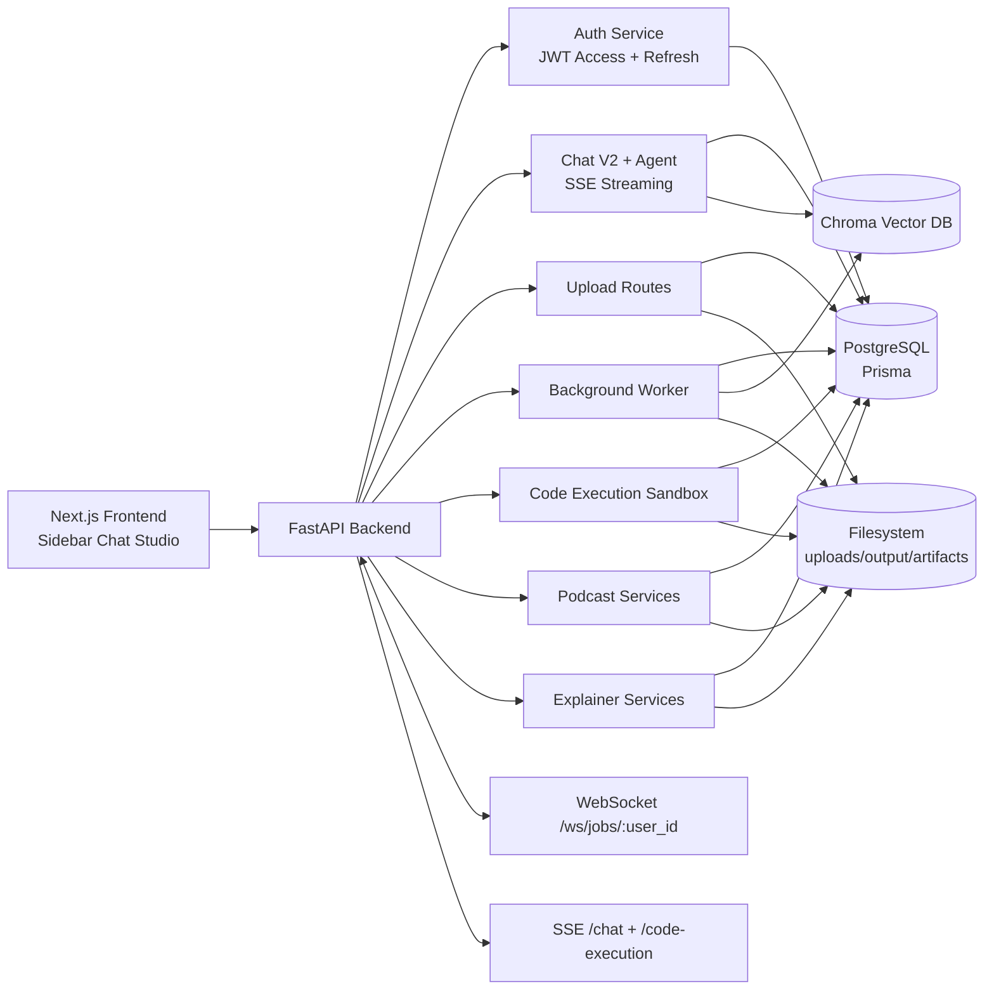
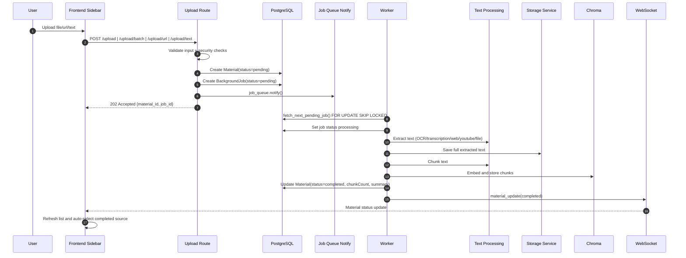
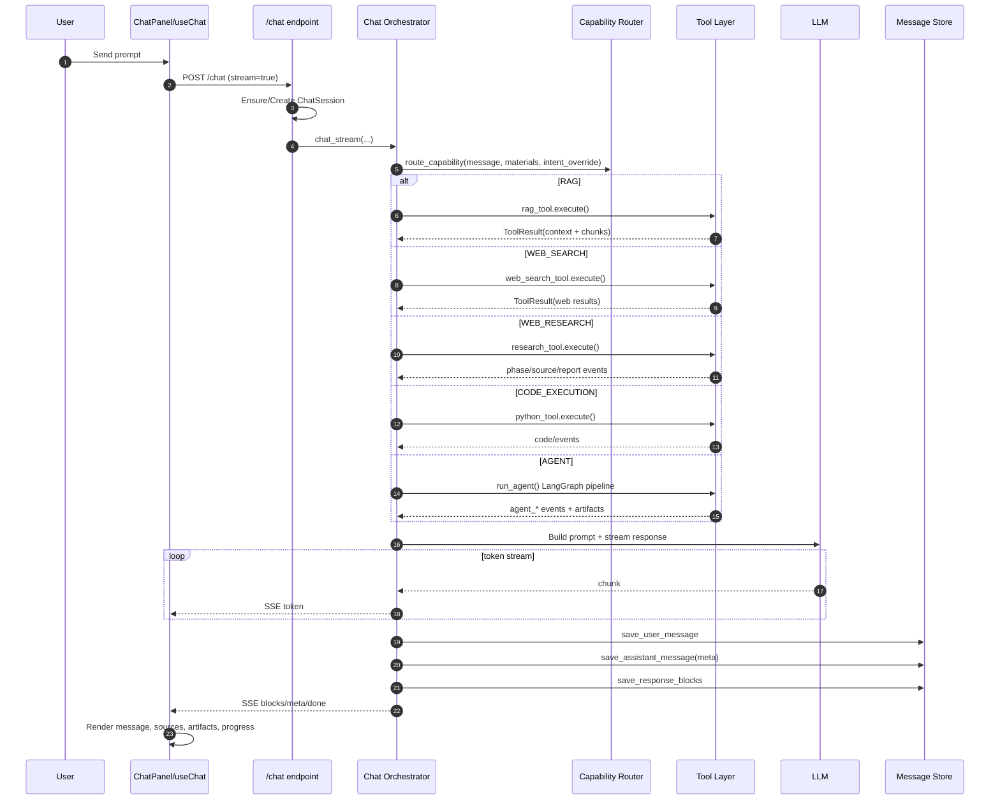
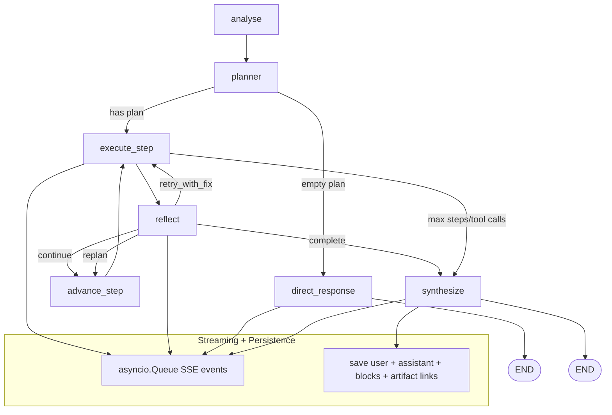
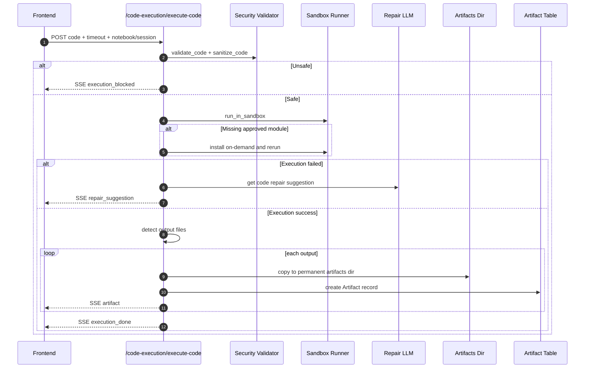
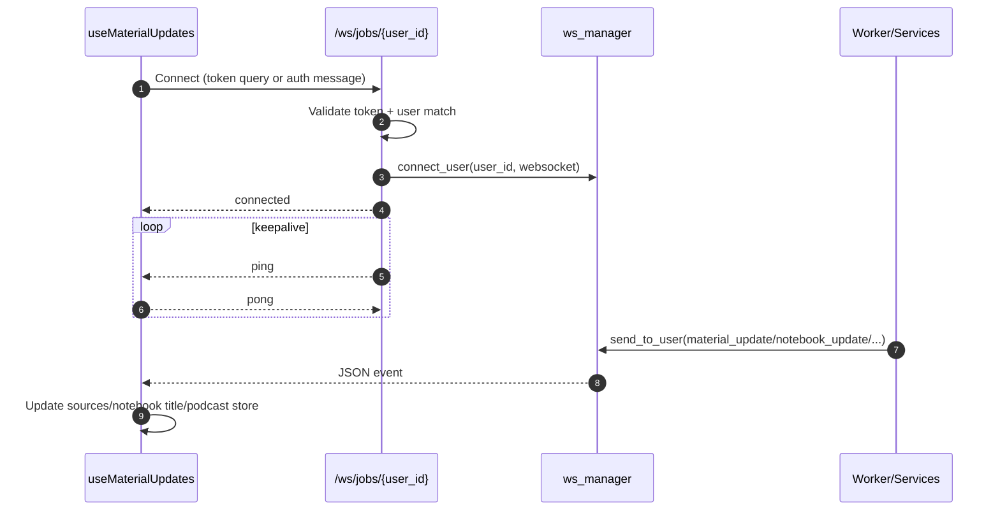
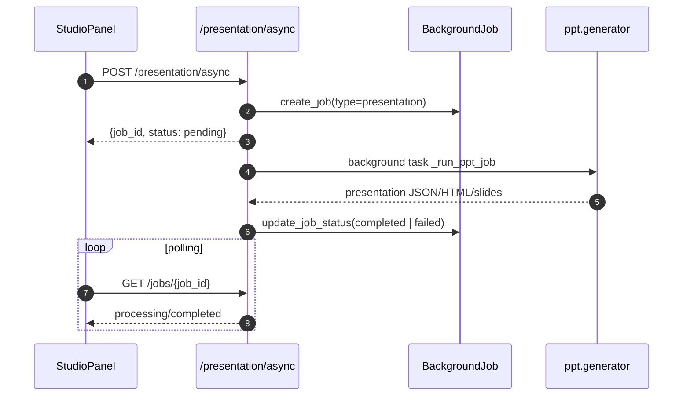
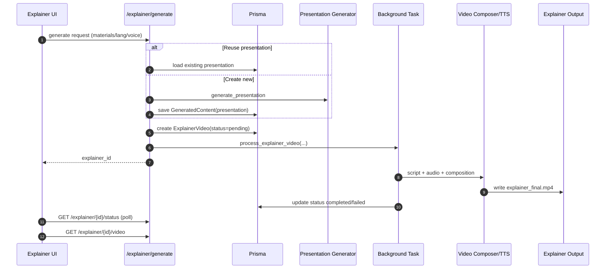
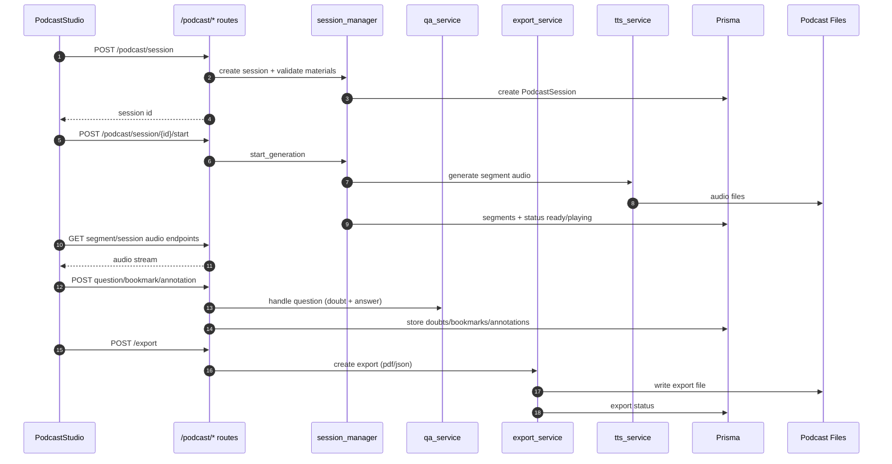
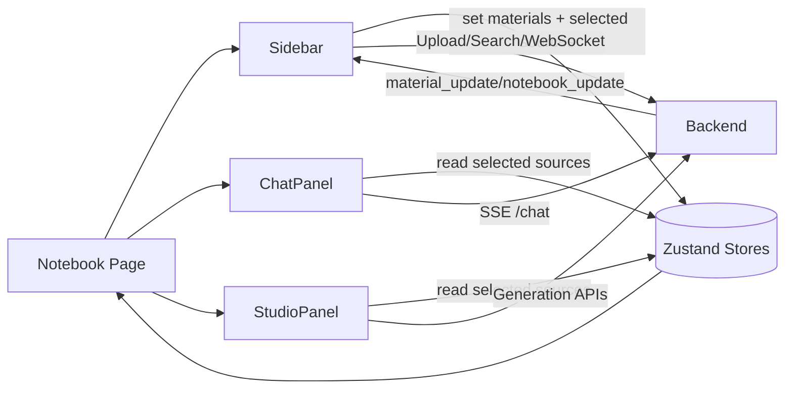

# KeplerLab System Flow

This file provides visual end-to-end flow diagrams for the main runtime paths in the current codebase.

## 1. High-Level Runtime Architecture

## 2. Upload -> Processing -> Material Ready

## 3. Chat Streaming (Normal/RAG/Web/Research/Agent)

## 4. Agent LangGraph Internal Flow

## 5. Code Execution -> Artifact Registration

## 6. WebSocket Job/Material Updates

## 7. Presentation Async Generation Flow

## 8. Explainer Generation Flow

## 9. Podcast Session Flow

## 10. Frontend Panel Coordination Flow

## 11. Notes

- SSE is the primary transport for long-running chat/agent/code responses.
- WebSocket is used for background status fanout (material and notebook updates, plus podcast events).
- Persistent state lives in PostgreSQL; semantic retrieval state lives in Chroma; binary artifacts live on filesystem with DB metadata references.
